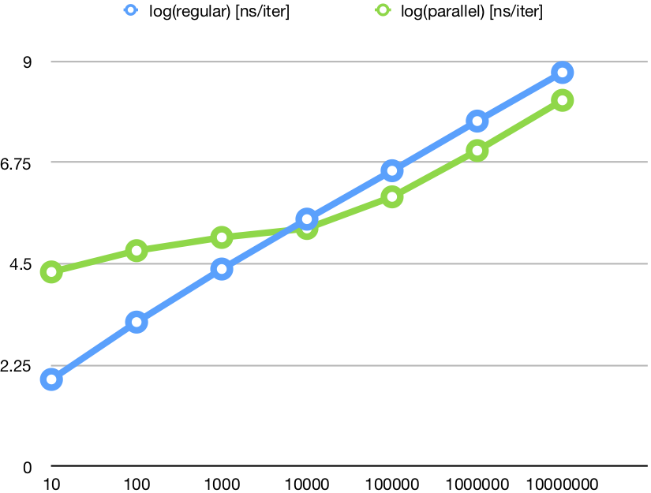

# Problem 1

For problem 1, I implemented a very simple Node.js app using the Express web framework.  The solution is hosted here: [http://paxos-interview.jeffbarg.com/messages](http://paxos-interview.jeffbarg.com/messages).

#### How to run  

```bash
cd paxos
npm install
node app.js
```
Note: the port in the source submitted is 3000, however I am running the app on http://paxos-interview.jeffbarg.com/ on port 80.

#### Performance Question
There are several possible bottlenecks from the current implementation.  First, all messages are stored on a single host in memory (from a single Node application).  The solution does not scale if the size of the messages stored exceeds the memory of the host.

A solution to fix this issue could be to have an off-host distributed key-value store (such as DynamoDB).  Other solutions that offload the message storage to a different host would work here as well (such as Redis / any SQL-variant such as Postgres).

Second, if the number of concurrent users increases beyond a certain threshold, the application host itself may not be able to serve all requests.  In this case, we should have multiple application hosts beyond a load balancer.

If this were a real application, it would be helpful to have usage metrics to understand how users are using the application (i.e. more reads than writes or vice versa, large vs. small messages on average).  This could help inform a decision on how best to scale.

# Problem 2

For problem 2, the basic algorithm I implemented to solve the problem was for each item (item #1) in the list, do a binary search through all previous items to find a second item (item #2) which had less than or equal to the remaining balance.  Then, find out of those (up to) N pairs of items the two which have the combined score closest to the gift card balance (the highest).

#### How to run 

My solution was a Rust application, so the first step to run is get rust (I believe I was using Nightly for benchmarks).

```bash
rustup default nightly
rustup update && cargo update
cd find-pair
cargo build --release
./target/release/find-pair data/prices.txt 2500
```

#### Benchmarks
I ran some benchmarks on the performance of the regular algorithm vs. a multi-threaded implementation using Rayon's parallelization.  The regular implementation outperformed the multithreaded version up to a certain data size, but after around 10,000 items, there was a consistent 4x speedup by using the multi-threaded version [1].

| n | Regular (ns) | Parallel (ns) |
|:--|:--|:--|
| 10 | 86 | 20849 |
| 100 | 1609 | 61884 |
| 1000 | 24199 | 121604 |
| 10000 | 309520 | 192320 |
| 100000 | 3672830 | 967021 |
| 1000000 | 46396784 | 10262336 |
| 10000000 | 555503805 | 134173680 |

Here is a Log-log plot of the above data:



#### Possible Improvements

Since the solution is implemented as a MapReduce problem, another possible speedup would be running this on several hosts using something like Hadoop / Spark.

#### Big O
Since the algorithm iterates through all items in the list, and for each item there is a binary search to find the highest possible complementary item (which is a log(n) operation), the algorithm is O(N log N) complexity.

#### Bonus Question
I didn't have a chance to get to the bonus question unfortunately :-(

A brute-force extension of the current solution I have is just to iterate through every pair of 2 items, and then do a binary search through all other items to find the item closest to the remaining balance for O(N^2 Log N) complexity.

I think there should be a way to do some dynamic programming tricks to get an O(N log^2 N) solution.  But I can't come up with it currently.  I may need to think more deeply on this.


[1]: Benchmarks were taken on my MacBook with a 2.6 GHz Intel Core i7.